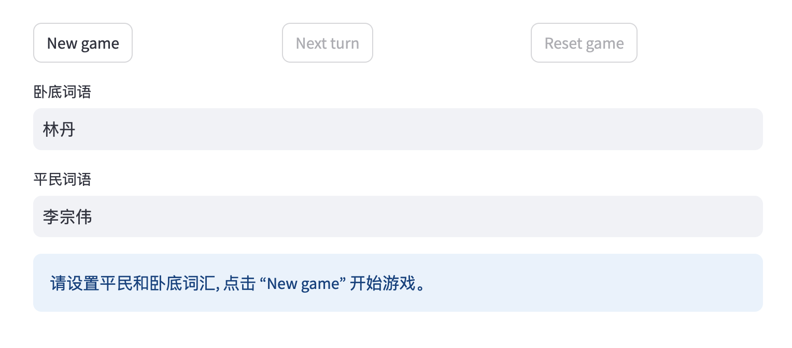
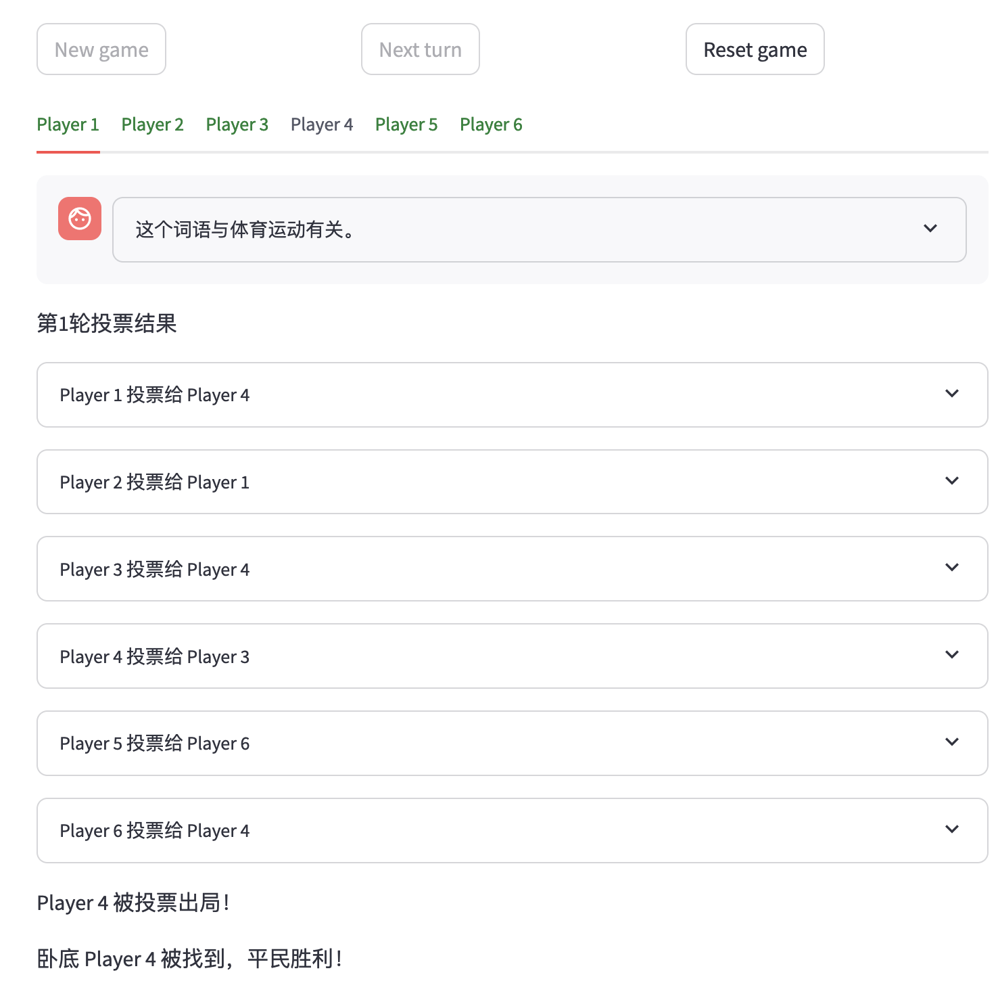

# multi-agent-who-is-undercover
基于LLM multi agents的《谁是卧底》游戏模拟。


## 定义AWS环境变量 
- 在当前目录下生成 **.env** 文件

     ```touch .env```

- 写入下面的内容

    ```
    AWS_ACCESS_KEY_ID=<your aws_access_key_id>
    AWS_SECRET_ACCESS_KEY=<your aws_secret_access_key>
    AWS_REGION=<aws_region>
    ```

## Streamlit方式运行
```bash
pip install -r requirements.txt
streamlit run who_is_undercover_frontend.py
```

## API方式运行
```bash
pip install -r requirements-api.txt
uvicorn main:app --reload
```

## 游戏截图
### 游戏开始


### 投票可视化


